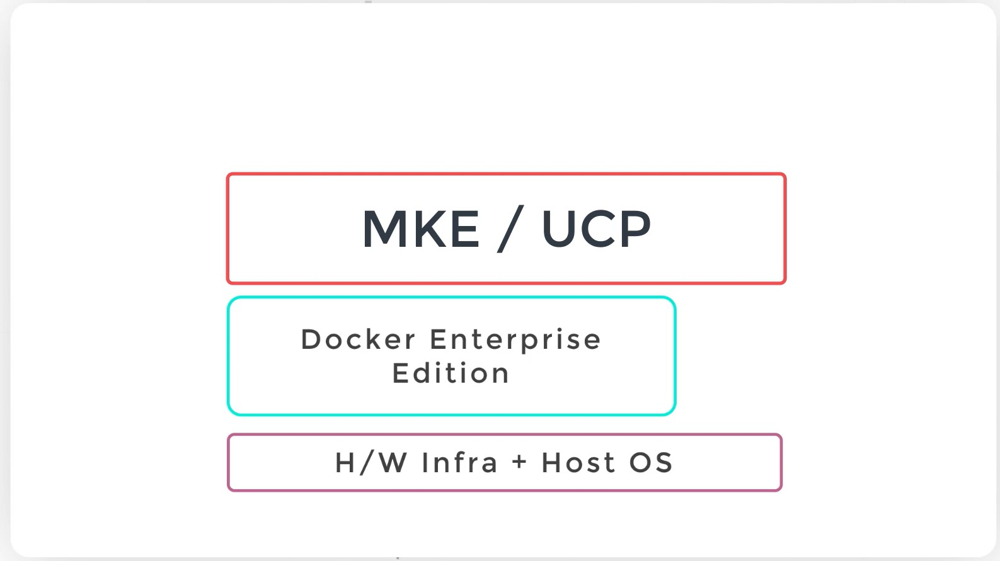
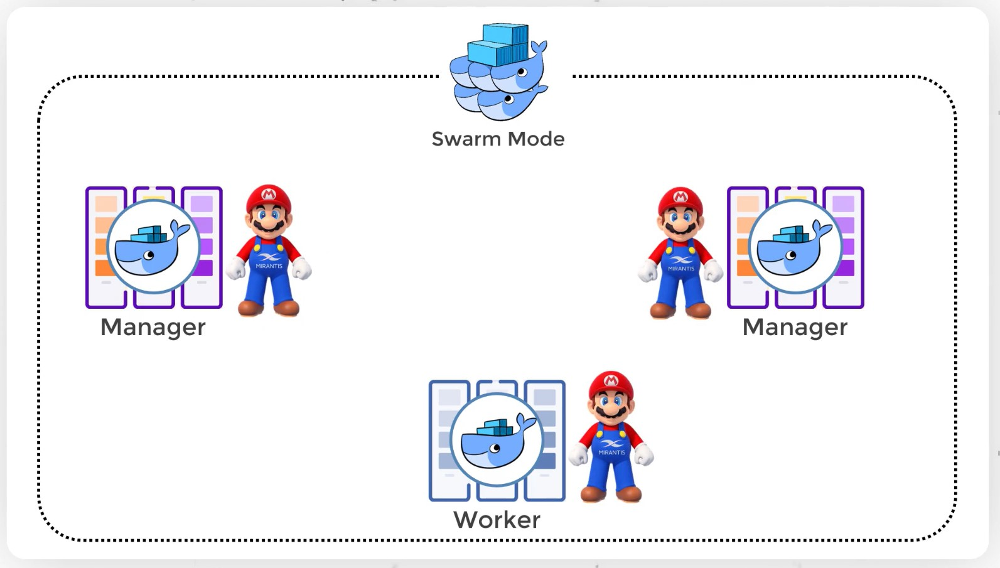
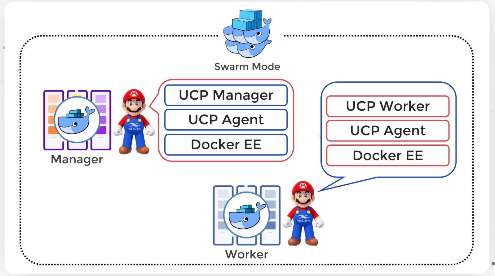
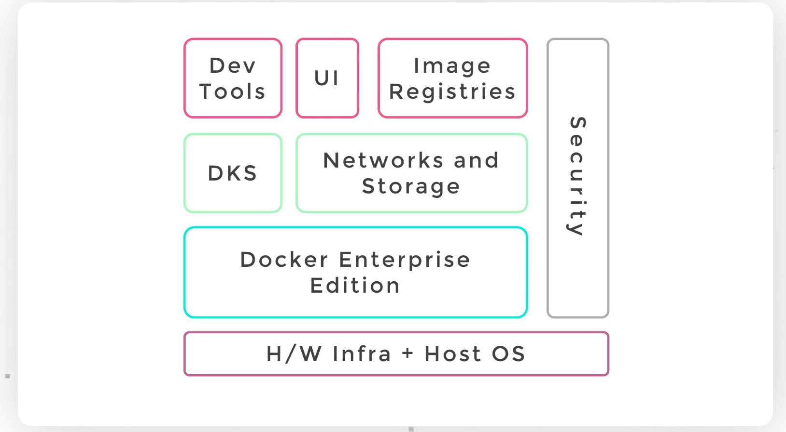

# Mirantis Kubernetes Engine - MKE 
## aka Universal Control Plan - UCP

* UCP uses Docker Enterprise Edition version
* MKE/UCP layer works as mediator layer between Docker EE and user

* UCP is installed on a swarm cluster. 
* It runs an agent process called UCP Agent.

