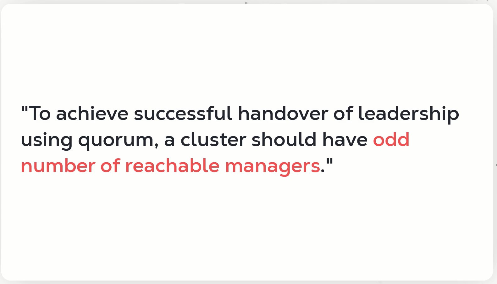

# DOCKER PRACTICE NOTES

## Docker Swarm


* Docker swarm command
* Manager need to advertise its IP Address along with token. 

```
docker swarm init --advertise-addr [OPTIONS]
docker swarm join-token worker|manager
```

```
manager:~$ sudo docker swarm init --advertise-addr 34.125.91.97 --availability drain

Swarm initialized: current node (t5ei1nquevrx71qw4r7i5thmz) is now a manager.

To add a worker to this swarm, run the following command:

    docker swarm join --token SWMTKN-1-155y66ret23x1kda5fviypiavbq9cdk4t9egy5w20f02bkn8wk-ehld0px63rm5cmon5te6h6hel 34.125.91.97:2377

To add a manager to this swarm, run 'docker swarm join-token manager' and follow the instructions.

manager:~$ sudo docker swarm join-token worker
```

```
docker node ls
```

* To run a service, make sure you r on a manager node.
```
manager:~$ docker service create --name redis-swarm redis
9hichqa9bvxp4bw4aykirqj0j
overall progress: 1 out of 1 tasks 
1/1: running   [==================================================>] 
verify: Service converged 

manager:~$ sudo docker service ls
ID             NAME          MODE         REPLICAS   IMAGE          PORTS
9hichqa9bvxp   redis-swarm   replicated   1/1        redis:latest   
```
* MODE shows replicated, other value is global
* Replicated services create desired replicas of each container 
* While global services run on replica of the container on each node.
* Global services are usefull for deamon process like logging agents
* Replicated services are used to deploy work loads.

* To list down the tasks inside the container 
```
manager:~$ sudo docker service ps redis-swarm
manager:~$ sudo docker service inspect  redis-swarm
[
    {
        "ID": "9hichqa9bvxp4bw4aykirqj0j",
        "Version": {
            "Index": 21
        },
        "CreatedAt": "2023-02-17T18:08:51.181312714Z",
        "UpdatedAt": "2023-02-17T18:08:51.181312714Z",
        "Spec": {
            "Name": "redis-swarm",
            "Labels": {},
            "TaskTemplate": {
                "ContainerSpec": {
                    "Image": "redis:latest@sha256:6a59f1cbb8d28ac484176d52c473494859a512ddba3ea62a547258cf16c9b3ae",
                    "Init": false,
                    "StopGracePeriod": 10000000000,
                    "DNSConfig": {},
                    "Isolation": "default"
                },
                "Resources": {
                    "Limits": {},
                    "Reservations": {}
                },
                "RestartPolicy": {
                    "Condition": "any",
                    "Delay": 5000000000,
                    "MaxAttempts": 0
                },
                "Placement": {
                    "Platforms": [
                        {
                            "Architecture": "amd64",
                            "OS": "linux"
                        },
                        {
                            "OS": "linux"
                        },
                        {
                            "OS": "linux"
                        },
                        {
                            "Architecture": "arm64",
                            "OS": "linux"
                        },
                        {
                            "Architecture": "386",
                            "OS": "linux"
                        },
                        {
                            "Architecture": "mips64le",
                            "OS": "linux"
                        },
                        {
                            "Architecture": "ppc64le",
                            "OS": "linux"
                        },
                        {
                            "Architecture": "s390x",
                            "OS": "linux"
                        }
                    ]
                },
                "ForceUpdate": 0,
                "Runtime": "container"
            },
            "Mode": {
                "Replicated": {
                    "Replicas": 1
                }
            },
            "UpdateConfig": {
                "Parallelism": 1,
                "FailureAction": "pause",
                "Monitor": 5000000000,
                "MaxFailureRatio": 0,
                "Order": "stop-first"
            },
            "RollbackConfig": {
                "Parallelism": 1,
                "FailureAction": "pause",
                "Monitor": 5000000000,
                "MaxFailureRatio": 0,
                "Order": "stop-first"
            },
            "EndpointSpec": {
                "Mode": "vip"
            }
        },
        "Endpoint": {
            "Spec": {}
        }
    }
]
```
* The first information is service ID, which is followd by the version index of docker aswell as the timestamp of service creation and update.
* We also get a Service Specification "Spec", which contains service metadata and container details, resource limitations and restart policies are encapsulated under a "TaskTemplate", since a containers are controlled by a task. 
* Than we have list of supported hardware and OS Architecture, "Placement": "Platforms".
* The service is executed by a container runtime environment and has never been force udpated "ForceUpdate": 0,"Runtime": "container"
* We have service "Mode" as replicated and one replica as with docker service ls command.  "Mode": {"Replicated": {"Replicas": 1} 
* Next are service update and rollback configurations."UpdateConfig" & "RollbackConfig"
* "Parallelism" defines how many tasks will be updated or rollbacked simultaneoulsy. Value 1 indicates service containers will be updated or rollback one by one.
* If the process gets interrupted or fails, the pause value of  "FailureAction" indicates that updates or rollback will be paused till the issue is resolved. 
* Both process also have  "Monitor": 5000000000, which indicates the timer before swarm start to monitor the update or rollback for failure. Typicall it is set in nanoseconds and default is 5 sec.
* "MaxFailureRatio": 0, indicates failure of updates or rollbacks to tolerate. 
* Finally "Order": "stop-first", can have one of the two values, if it is set to stop-first, which is the default it will stop the service first before updating it or rolling it back.
* And if it is set to start-first, it will start the update service before stopping the previous version. 

* To scale the service to 4 tasks from 1.
```
docker service scale SERVICE=REPLICA_COUNT

sudo docker service scale redis-swarm=4
redis-swarm scaled to 4
overall progress: 4 out of 4 tasks 
1/4: running   [==================================================>] 
2/4: running   [==================================================>] 
3/4: running   [==================================================>] 
4/4: running   [==================================================>] 
verify: Service converged 
```

```
manager:~$ sudo docker service ls 
ID             NAME          MODE         REPLICAS   IMAGE          PORTS
9hichqa9bvxp   redis-swarm   replicated   4/4        redis:latest   

manager:~$ sudo docker service ps redis-swarm
ID             NAME            IMAGE          NODE       DESIRED STATE   CURRENT STATE                ERROR     PORTS
6h521ko0g056   redis-swarm.1   redis:latest   worker-1   Running         Running about an hour ago              
6s81bv13y0on   redis-swarm.2   redis:latest   worker-2   Running         Running about a minute ago             
oquwztyqu3fw   redis-swarm.3   redis:latest   worker-1   Running         Running about a minute ago             
axy8llteogj0   redis-swarm.4   redis:latest   worker-2   Running         Running about a minute ago      
```

# Docker Swarm's Overlay Network

```
manager:~$ sudo docker network ls
NETWORK ID     NAME              DRIVER    SCOPE
3d8f5b41b324   bridge            bridge    local
a09523deb3ba   docker_gwbridge   bridge    local
0074cf04f0b5   host              host      local
uztwctt4tvl4   ingress           overlay   swarm
296f1c48bae2   none              null      local
```
* SWARM mode activation created ingress and docker_gwbridge networks. If we donot connect any container to any user defined overlay network, swarm connects to ingress network by default to provide configurations for control and data traffic.
* docker_gwbridge is just another bridge network.

```
sudo docker network inspect ingress
[
    {
        "Name": "ingress",
        "Id": "uztwctt4tvl4iqmjz12sg1gtl",
        "Created": "2023-02-17T17:58:20.791620838Z",
        "Scope": "swarm",
        "Driver": "overlay",
        "EnableIPv6": false,
        "IPAM": {
            "Driver": "default",
            "Options": null,
            "Config": [
                {
                    "Subnet": "10.0.0.0/24",
                    "Gateway": "10.0.0.1"
                }
            ]
        },
        "Internal": false,
        "Attachable": false,
        "Ingress": true,
        "ConfigFrom": {
            "Network": ""
        },
        "ConfigOnly": false,
        "Containers": {
            "ingress-sbox": {
                "Name": "ingress-endpoint",
                "EndpointID": "5af74a9d1e7e9fb47847bdd9f03ee657bab3617da42cb9d0c4e320c59dde9a9f",
                "MacAddress": "02:42:0a:00:00:03",
                "IPv4Address": "10.0.0.3/24",
                "IPv6Address": ""
            }
        },
        "Options": {
            "com.docker.network.driver.overlay.vxlanid_list": "4096"
        },
        "Labels": {},
        "Peers": [
            {
                "Name": "ebc83478dd2d",
                "IP": "10.182.0.4"
            }
        ]
    }
]
```
* The driver used to create this network is of type overlay, "Driver": "overlay".
* "Ingress": true, is set to true, to create ingress rules for swarm traffic. 
* Finally, "Peers", this is only applicable to networks which covers more than one machines in form of a cluster. Such, as an overlay network. This fields shows list of networks connected to the overlay network.
* The first one is manager and other are workers.
* SWARM creates a virtual gossip cluster for overlay network which indicates a service base relationship.
* If the nodes are connected by a service they will be listed here, for example the redis service is scheduled on two workers and is being managed by the manager, thus all three of them are part of the conversatoin around that service. That is why they are listed here as peers.The id in Name field is unique in gosip cluster and can't be used any where else.
* This network also runs a deamon container on each node as its endpoint. 

```
docker network create \
> --driver overlay \
> --subnet=10.15.0.0/16 \
> --gateway=10.15.0.2 \
> --opt encrypted \
> --attachable \
> my-swarm-net

manager:~$ sudo docker network ls
NETWORK ID     NAME              DRIVER    SCOPE
3d8f5b41b324   bridge            bridge    local
a09523deb3ba   docker_gwbridge   bridge    local
0074cf04f0b5   host              host      local
uztwctt4tvl4   ingress           overlay   swarm
d1vrxd69cghi   my-swarm-net      overlay   swarm

```
* The attachable flag is used to troubleshoot the network by manually attaching its deamon containers to the terminal.
* As long there is no service connected to this network which has its tasks scheduled on one or both of the workers, the network won't be listed on those workers.

#### Connecting a Service to Overlay Network
```
manager:~$ sudo docker service create --name  nginx-swarm --constraint node.role!=manager --label testGroup=a1 --mount type=volume,source=nginx-vol-swarm,destination=/etc/nginx --network my-swarm-net --replicas 3 --replicas-max-per-node 2 --restart-max-attempts 3 --publish 8080:80 --update-parallelism 2 nginx
```

#### Service rollout & rollback
* rolling out an update means passing or performing the update through all of the task of service.
* rolling it back mean reversing the tasks to back its previous stage.
* Exceptionnaly service updates may event consist of simple configurations which may not effect the active tasks.

```
manager:~$ sudo docker node update --availability active manager
manager:~$ sudo docker node ls
ID                            HOSTNAME   STATUS    AVAILABILITY   MANAGER STATUS   ENGINE VERSION
t5ei1nquevrx71qw4r7i5thmz *   manager    Ready     Active         Leader           23.0.1
tpb7dihhun5icsdzegef2y3kv     worker-1   Ready     Active                          23.0.1
jrxv5bexi3brdsaw9jdqo78dw     worker-2   Ready     Active                          23.0.1

manager:~$ sudo docker service scale nginx-swarm=6
nginx-swarm scaled to 6
overall progress: 6 out of 6 tasks 
1/6: running   [==================================================>] 
2/6: running   [==================================================>] 
3/6: running   [==================================================>] 
4/6: running   [==================================================>] 
5/6: running   [==================================================>] 
6/6: running   [==================================================>] 
verify: Service converged 

manager:~$ sudo docker service ps nginx-swarm
ID             NAME            IMAGE          NODE       DESIRED STATE   CURRENT STATE            ERROR     PORTS
85tmovpeg4yl   nginx-swarm.1   nginx:latest   worker-1   Running         Running 38 minutes ago             
ml8ufseg0ib8   nginx-swarm.2   nginx:latest   worker-2   Running         Running 38 minutes ago             
8bwc29rfrm30   nginx-swarm.3   nginx:latest   worker-2   Running         Running 38 minutes ago             
q545pangdwtz   nginx-swarm.4   nginx:latest   manager    Running         Running 40 seconds ago             
rijl1hoc5zgc   nginx-swarm.5   nginx:latest   manager    Running         Running 40 seconds ago             
gmor8etkn6il   nginx-swarm.6   nginx:latest   worker-1   Running         Running 48 seconds ago             

sudo docker service scale nginx-swarm=7
nginx-swarm scaled to 7
overall progress: 6 out of 7 tasks 
1/7: no suitable node (max replicas per node limit exceed) 
2/7: running   [==================================================>] 
3/7: running   [==================================================>] 
4/7: running   [==================================================>] 
5/7: running   [==================================================>] 
6/7: running   [==================================================>] 
7/7: running   [==================================================>] 
^COperation continuing in background.
Use `docker service ps nginx-swarm` to check progress.

manager:~$ sudo docker service ps nginx-swarm
ID             NAME            IMAGE          NODE       DESIRED STATE   CURRENT STATE            ERROR                              PORTS
85tmovpeg4yl   nginx-swarm.1   nginx:latest   worker-1   Running         Running 40 minutes ago                                      
ml8ufseg0ib8   nginx-swarm.2   nginx:latest   worker-2   Running         Running 40 minutes ago                                      
8bwc29rfrm30   nginx-swarm.3   nginx:latest   worker-2   Running         Running 40 minutes ago                                      
q545pangdwtz   nginx-swarm.4   nginx:latest   manager    Running         Running 2 minutes ago                                       
rijl1hoc5zgc   nginx-swarm.5   nginx:latest   manager    Running         Running 2 minutes ago                                       
gmor8etkn6il   nginx-swarm.6   nginx:latest   worker-1   Running         Running 3 minutes ago                                       
pjvxvrzcskl9   nginx-swarm.7   nginx:latest              Running         Pending 57 seconds ago   "no suitable node (max replica…"   

manager:~$ sudo docker service update --rollback nginx-swarm
nginx-swarm
rollback: manually requested rollback 
overall progress: rolling back update: 6 out of 6 tasks 
1/6: running   [==================================================>] 
2/6: running   [==================================================>] 
3/6: running   [==================================================>] 
4/6: running   [==================================================>] 
5/6: running   [==================================================>] 
6/6: running   [==================================================>] 
verify: Service converged 
```

* Alternatively, can use 
```
manager:~$ sudo docker service rollback --detach SERVICE
```

## **Raft and Quorum Consensus**




## **Node Roles and Raft Consensus**

```
manager:~$ sudo docker node ls
ID                            HOSTNAME   STATUS    AVAILABILITY   MANAGER STATUS   ENGINE VERSION
t5ei1nquevrx71qw4r7i5thmz *   manager    Ready     Active         Leader           23.0.1
tpb7dihhun5icsdzegef2y3kv     worker-1   Ready     Active                          23.0.1
jrxv5bexi3brdsaw9jdqo78dw     worker-2   Ready     Active                          23.0.1
q6ekka94xo93ux2nq1iscat46     worker-3   Ready     Active                          23.0.1
rhcs3756db1f08euun1jlbii3     worker-4   Ready     Active                          23.0.1

manager:~$ sudo docker node promote worker-3 worker-4
Node worker-3 promoted to a manager in the swarm.
Node worker-4 promoted to a manager in the swarm.

manager:~$ sudo docker node ls
ID                            HOSTNAME   STATUS    AVAILABILITY   MANAGER STATUS   ENGINE VERSION
t5ei1nquevrx71qw4r7i5thmz *   manager    Ready     Active         Leader           23.0.1
tpb7dihhun5icsdzegef2y3kv     worker-1   Ready     Active                          23.0.1
jrxv5bexi3brdsaw9jdqo78dw     worker-2   Ready     Active                          23.0.1
q6ekka94xo93ux2nq1iscat46     worker-3   Ready     Active         Reachable        23.0.1
rhcs3756db1f08euun1jlbii3     worker-4   Ready     Active         Reachable        23.0.1
```
* The manager status 'Reachable' means if the leader manager is too busy to respond to some requests these reachable managers can act on its behalf and If something happens to the leader, they can contest the leader election for Leader status.
*  

```
manager:~$ sudo docker node demote manager

worker-3:~$ sudo docker node ls
ID                            HOSTNAME   STATUS    AVAILABILITY   MANAGER STATUS   ENGINE VERSION
t5ei1nquevrx71qw4r7i5thmz     manager    Ready     Active                          23.0.1
tpb7dihhun5icsdzegef2y3kv     worker-1   Ready     Active                          23.0.1
jrxv5bexi3brdsaw9jdqo78dw     worker-2   Ready     Active                          23.0.1
q6ekka94xo93ux2nq1iscat46 *   worker-3   Ready     Active         Reachable        23.0.1
rhcs3756db1f08euun1jlbii3     worker-4   Ready     Active         Leader           23.0.1

worker-3:~$ sudo docker node demote worker-4
Manager worker-4 demoted in the swarm.

worker-3:~$ sudo docker node ls
ID                            HOSTNAME   STATUS    AVAILABILITY   MANAGER STATUS   ENGINE VERSION
t5ei1nquevrx71qw4r7i5thmz     manager    Ready     Active                          23.0.1
tpb7dihhun5icsdzegef2y3kv     worker-1   Down      Active                          23.0.1
jrxv5bexi3brdsaw9jdqo78dw     worker-2   Ready     Active                          23.0.1
q6ekka94xo93ux2nq1iscat46 *   worker-3   Ready     Active         Leader           23.0.1
rhcs3756db1f08euun1jlbii3     worker-4   Ready     Active                          23.0.1

worker-3:~$ sudo docker node rm worker-3
Error response from daemon: rpc error: code = FailedPrecondition desc = node q6ekka94xo93ux2nq1iscat46 is a cluster manager and is a member of the raft cluster. It must be demoted to worker before removal

worker-3:~$ sudo docker node demote  worker-3
Error response from daemon: rpc error: code = FailedPrecondition desc = attempting to demote the last manager of the swarm

worker-3:~$ sudo docker swarm leave 
Error response from daemon: You are attempting to leave the swarm on a node that is participating as a manager. Removing the last manager erases all current state of the swarm. Use `--force` to ignore this message.

worker-3:~$ sudo docker swarm leave --force
Node left the swarm.
```


```
docker swarm init --force-new-cluster --advertise-addr IP-ADDRESS
```
* This will cut all of the ties from previous cluster and make this node the manager and leader of the new cluster. advertise the external IP address also.

```
worker-4:~$ sudo docker swarm leave

worker-4:~$ sudo docker swarm init --force-new-cluster --advertise-addr 34.125.26.145
Swarm initialized: current node (q9fm1asdoarm0rwrc1bmiusjo) is now a manager.

To add a worker to this swarm, run the following command:

    docker swarm join --token SWMTKN-1-46uqgwrsn74ragybqyujhl6cgssxtrrpiw27rp3s2pkv50442f-aouu2d3ttvcjjt2rqcpfnaz35 34.125.26.145:2377

To add a manager to this swarm, run 'docker swarm join-token manager' and follow the instructions.

worker-4:~$ sudo docker service ls
ID        NAME      MODE      REPLICAS   IMAGE     PORTS

worker-4:~$ sudo docker service create --name redis-swarm --mode global redis:latest
810cjdx6yewbyfy2ulxmqjv5a
overall progress: 1 out of 1 tasks 
q9fm1asdoarm: running   [==================================================>] 
verify: Service converged 

worker-4:~$ sudo docker service ls
ID             NAME          MODE      REPLICAS   IMAGE          PORTS
810cjdx6yewb   redis-swarm   global    5/5        redis:latest   

worker-4:~$ sudo docker service ps redis-swarm
ID             NAME                                    IMAGE          NODE       DESIRED STATE   CURRENT STATE                ERROR     PORTS
2z8e7zg2bs1v   redis-swarm.3enb9hvo3hbz4pnm8bd8j197j   redis:latest   worker-3   Running         Running about a minute ago             
gg1qyu5goxoq   redis-swarm.8f7hg6sq3h5uvc72fb8ek64v9   redis:latest   manager    Running         Running 7 minutes ago                  
i3h0pzau9scl   redis-swarm.ctjy1v58rimy0wty9f8js7eaq   redis:latest   worker-2   Running         Running 3 minutes ago                  
npzbas28yrhe   redis-swarm.q9fm1asdoarm0rwrc1bmiusjo   redis:latest   worker-4   Running         Running 42 minutes ago                 
76b1rfjkekc0   redis-swarm.v1wymhxp3wmbzwotu4rolngc2   redis:latest   worker-1   Running         Running 5 minutes ago                  

worker-4:~$ sudo docker node promote manager

```

## Locking the swarm cluster
* It encryptes TLS keys for node to node communications as well as the raft logs. 
* docker swarm uses raft alogrithm to maintain concensus among the managers to maintain an undisputed and transparent hierachy of authority. 
* To make sure leader election and leadership handover smooth, all managers on swarm cluster maintain logs of request exchange, such logs are called raft logs. 
* Even if a manager gives up on being a leader, the new leader will be uptodate regarding past events within no time. 
* Locking the swarm cluster means blocking the request by encrypting the raft logs and communication TLS.

```
worker-4:~$ sudo docker swarm update --autolock=true
Swarm updated.
To unlock a swarm manager after it restarts, run the `docker swarm unlock`
command and provide the following key:

    SWMKEY-1-EJ7mwBZfveTvrgG8ZZexLn92Q0IOYHDis5/WycvBahU

Please remember to store this key in a password manager, since without it you
will not be able to restart the manager.

worker-4:~$ sudo systemctl restart docker
worker-4:~$ sudo docker node ls
Error response from daemon: Swarm is encrypted and needs to be unlocked before it can be used. Please use "docker swarm unlock" to unlock it.

worker-4:~$ docker swarm unlock

worker-4:~$ docker swarm unlock-key

worker-4:~$ sudo docker swarm unlock-key
To unlock a swarm manager after it restarts, run the `docker swarm unlock`
command and provide the following key:

    SWMKEY-1-EJ7mwBZfveTvrgG8ZZexLn92Q0IOYHDis5/WycvBahU

Please remember to store this key in a password manager, since without it you
will not be able to restart the manager.

worker-4:~$ sudo docker swarm unlock-key --rotate

worker-4:~$ sudo docker swarm update --autolock=false
Swarm updated.

```
** --rotate flag rotates the unlock key, replacing it with a new randomly-generated key. The old key is irrelevant now.
**  --autolock=false flag, to disable to autolock feature.

* running cluster from backup swarm config.
```
worker-4:~$ sudo systemctl stop docker
worker-4:~$ sudo -i
root@worker-4:~# rm -rf /var/lib/docker/swarm
root@worker-4:~# cp -r /home/shoaib_soomro/swarm-backup/swarm/ /var/lib/docker/
root@worker-4:~# exit
worker-4:~$ sudo systemctl start docker
```

## Cleaup the swarm cluster

```
worker-4:~$ sudo docker service rm SERVICENAME
worker-4:~$ sudo docker node rm [OPTIONS] NODE_ID or NODE_NAME
worker-4:~$ sudo docker node rm manager
Error response from daemon: rpc error: code = FailedPrecondition desc = node hms0ydiez1o0s93ja37ebbr7t is not down and can't be removed
worker-4:~$ sudo docker node rm manager --force
manager

```