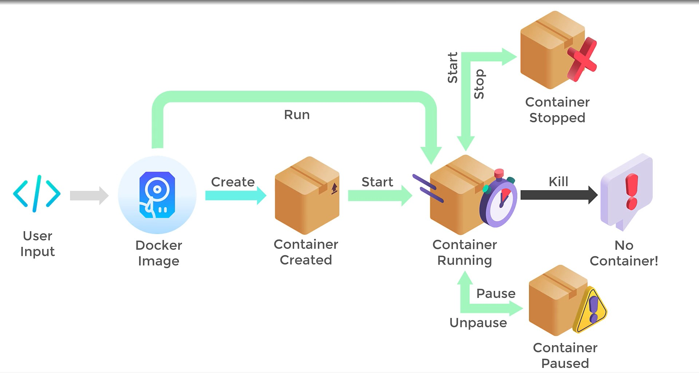

# Docker Container Lifecycle



## CREATE
   * Docker CREATE: [DOCKER-IMAGE] ---CREATE---> [DOCKER-CONTAINER]
```
> docker create [OPTIONS] IMAGE COMMAND [ARGS]
```
   * This command is applied on docker images. docker images are stacked sequence of read-only file system layers. This command appends a writable layer on top of them and size of the writable layer depends on the resource limit set for the container. It can make adjustments to pulled docker image layers. 
```   
> docker create -it \
	--name ubuntu-create \
	--cpus="0.5" \
	--cap-add=ALL \
	--env "LOGNAME=Shoaib Soomro" \
	--memory=400M \
	--memory-reservation=200M \
	--pid=host \
	--privileged \
	--restart=always \
	ubuntu:18.04
```

  * Docker process is created 
```
> docker ps -a 
```

## START 
   * Docker CREATE: [CONTAINER-CREATED] ---START---> [CONTAINER-RUNNNIG]

```   
> docker start [OPTIONS] CONTAINER
> docker start ubuntu-create
```

## RUN
   * Docker RUN: [DOCKER-IMAGE] ---RUN---> [CONTAINER-RUNNNIG] 
   * Both of the stages can be combined into one command > docker RUN
```   
> docker run -it \
	--name ubuntu-run \
	--cpus="0.5" \
	--cap-add=ALL \
	--env "LOGNAME=Shoaib Soomro" \
	--memory=400M \
	--memory-reservation=200M \
	--pid=host \
	--privileged \
	--restart=always \
	ubuntu:18.04
```

## PAUSE
   * Docker PAUSE: [CONTAINER-RUNNNIG] ---PAUSE---> [CONTAINER-PAUSED]
```
> docker pause [OPTIONS] CONTAINER
> docker pause ubuntu-run
```
   * Containers use C-GROUP. When we pause container it put SIGSTOP signal on them until we un-pause them. The container process doesnot exit it stays entier time and C-GROUP is still active and resources are not freedup. It is just a temporary frozen state.
```   
> docker unpause [OPTIONS] CONTAINER
> docker unpause ubuntu-run
```

## STOP
   * Docker STOP: [CONTAINER-RUNNNIG] ---STOP---> [CONTAINER-STOPPED]
```
> docker stop [OPTIONS] CONTAINER
```
   * In this phase the init or first process of the container recevies a termination signal SIGTERM from parent process of the host. The only significant flag this command have is -t which is --time. The grace period before sending SIGKILL

## KILL 
   * Docker STOP: [CONTAINER-RUNNNIG] ---KILL---> [NO-CONTAINER]

```
> docker kill [OPTIONS] CONTAINER
```

   * Instead of waiting for a grace period like docker stop, this commands directly send SIGKILL and kills the container by OOM i.e. Out Of Memory error.

```
> docker kill --signal SIGQUIT CONTAINER ...
```

   * This changes the signal for killing the container from SIGKILL to SIGQUIT or SIGHUP (signal hangup)
----------------------------------------------------------------------------------

# Docker Commands

## RENAME
```
> docker rename <container_old_name> <container_new_name>
> docker rename ubuntu-run ubuntu-dev
```
   * Once the docker name is overwritten it cannot be referenced using the old name.

## ATTACH
   * This command is use to attach the host STDIN, STDOUT and STDERROR to the container and interact with it. It brings the CMD or ENTRYPOINT of container to the foregroud of your host. Since the shell process is in the foreground exiting it will result in termination of container as without any executable process. The container will automatically assume SIGTERM for its PID 1. As soon you exit from the shell the container gets terminated and restart. 
   * A simple way is to run the container with deamon -d and interactive -it flags. This way even when you exit the shell the contaier will run in the background.
```
> docker attach [OPTIONS] <conatiner-name/ID>
```

## EXEC
   * Execute the commands on the running container. Only single command is allowed. Piping and multiple commands combined with logical 'and' && operator will not work. 
   * This will not work 

```
> docker exec [OPTIONS] <conatiner> <command>, <command>
```

   * Althoug can pass multiple arguments to the main command which could lead to the nesting of one command to the other.
 
```
> docker exec [OPTIONS] <conatiner> <command ARG1, ARG2, ARG3 ....>
```

   * Other way is opening a exec shell and do the job. The commands run in the PWD defined by the WORKDIR of a container. The exec commands work on the running container only.
```
> docker exec [OPTIONS] <conatiner> <command>
> docker exec ubuntu-dev touch /tmp/readme.txt
> docker attach ubuntu-dev
```

## COMMIT
   * The docker push, pull, load and save methods are use to share built images. This is usefull for migrating live container from one infrastructure to another. This command is used to store any changes made to the container inform of a new docker image. The currently running container snapshot is exported as an image and the image than run as a container. Commiting the container will append the current writable layer to the read-only layer and stack it on top of other layers to create new image.
```   
> docker commit [OPTIONS] <container> <image:tag>
> docker commit --author="Shoaib Soomro" ubuntu-dev ubuntu-dev:v1
> docker run -itd --name ubuntu-commit ubuntu-dev:v1
```

## Export - Import Method
   * Similar to commit except instead of turning running container into an image it saves the file system of the container i.e all of its files in its namespace with there folder arrangements in that. The file system is turned into a tarball with the EXPORT command. And can be imported as an image on any host. 
```   
> docker export --output="ubuntu-18.04-v1.tar" ubuntu-commit
```

```
> docker import [OPTIONS] file|URL|- <image>:<tag> 
```

```
> docker import \
 --message "This is an imported container FS." \
 --change "CMD bash" \
 ubuntu-18.04-v1.tar \
 ubuntu-import:v1
```

## STATS
```
> docker stats
```

```
> docker stats ubuntu-dev
```

```
> docker exec -it ubuntu-dev bash
```

```
> docker stats --no-stream --all
```

## TOP 
   * Processes running inside the containers.
```
> docker top <container> 
> docker top ubuntu-dev
```

## DIFF
  * It provides a change log of the filesystem since we ran the container. 
```
> docker diff ubuntu-dev
```

## WAIT
 * It is use to block the container and print the exit code when it stops. It wraps a tiny process around the container that catches the exit code when the container is stopped or killed.

```
> docker wait <container> 
> docker wait ubuntu-dev
> 137 (oom out of memory error)
> docker stop ubuntu-dev
```

## Sharing files with containers
   * Provisions a REST interface for sharing files from host to containers and vise-versa when source and destination is a file it is copy and replce operation on files.
   * But destination can also be directory. Then file will simply be added in the destination directory.
   * If destination directory does exist the docker deamon will throw error.
   * If the source is directory and destination can be existing or new directory, which will result in simple copy operation. Non existing path will be created.
   * If source directory is like Directory/. The entire content of destination directory is replaced.

```
> docker cp [OPTIONS] CONTAINER:SRC_PATH DEST_PATH
> docker cp [OPTIONS] SRC_PATH CONTAINER:DEST_PATH
> mkdir apache-server && cd apache-server
> nano index.html
> docker run -d --name apache-server -p 8080:80 httpd
> docker cp /home/shoaib_soomro/apache-server/index.html \
	apache-server:/usr/local/apache2/htdocs/index.html
> Successfully copied 2.048kB to apache-server:/usr/local/apache2/htdocs/index.html
```

## INSPECT
```
> docker inspect apache-server
> docker inspect --format='{{range.NetworkSettings.Networks}}{{.IPAddress}}{{end}}' apache-server
```

## LOGS
   * Docker is equiped with a deamon called logging agent or logging driver. The logging agent are responsible for collecting, managing, sorting and streaming the logs of a process as per the user requirement.
   * By default, Docker uses json-file logging driver which collects logs in JSON format internally.
   * Also logs can be streamed as they get generated.
```
> docker logs --follow CONTAINER
```

   * Also can limit the number of logs to be displayed by using the tail flag. 
```
> docker logs --tail 5 CONTAINER
```

   * Also third-party logging drivers can be plugged in and used. These are available in docker registry.

## CONTAINER CLEANUP
```
> docker rm [OPTIONS] container/<ID>
```

   * Running container cannot be removed. Or can use force flag to remove it.

```
> docker rm apache-server --force
```

   * The stopped container have still occupied there resources thats why they are called zombie containers or dangling containers.
   * All such can be removed by docker container prune command. 

```
> docker container prune
> docker rm $(docker ps -a -q) --force
```
