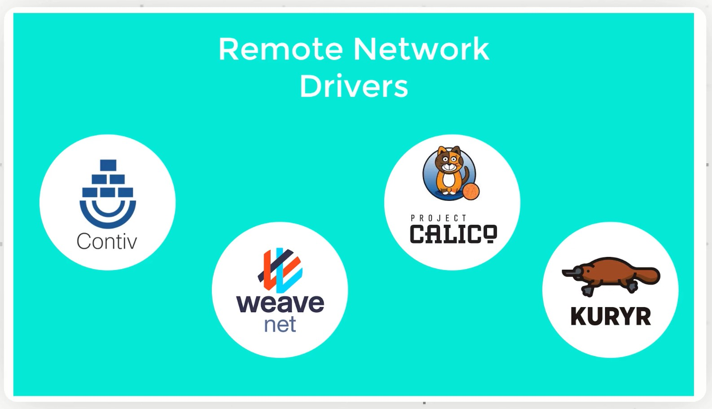

# DOCKER NETWORKING

## Port Mapping Networking
 Exposing the port inside the container to the host. All the traffic from host will be ridirected to the container.
```
> docker run -d -p 80:80 web-server 
```

## Bridge Networking
 When container is lunched it attaches itself to docker bridge and uses that bridge to get IP addresses and all the traffic go via the bridge to the outside world by ethernet 0 i.e. eth0. 
 Use the links or the docker networks in order to have containers talking to each other, on that bridge network.
```
> docker run -it -name server web-server
> docker run -it -link server:server client
```

## Host Networking
 Define the network of the host at the container launch time.This maps the network from the host OS into the container.
 It can do anything with host network, open any network port or bind to any IP Address. Still can access localhost port 80 eventhough not mapped explicity because internally container has that access.
```
> docker run -it --net=host server
```

## Overlay Networking
 Overlay network is basically the way that two containers on two different machines can talk to each other and different apporaches in different ways. Docker did it with consul for service discovery and then use its VXLAN without any encryption for container to container multi host networking.

## How to connect containers to the rest of the infrastructure
There are at least three ways to integrate containers in your network
  * Start the container and let docker allocate a public port for it. 
  * And then take that port and use in other system configuration like load balancer etc.
  * OR pick a fixed port in advance by setting docker run -p
  * OR use network plugin, connecting all the containers like VLAN

## Network Drivers
  * bridge i.e default
  * none
  * host
  * container

The driver is selected with docker run --net .....

### Bridge
  * By default the container gets a virtual eth0 interface. In addition to its own private lo loopback interface. That interace is provided by a veth pair.
  * It is connected to the Docker bridge (Named docker0 by default; configrable with --bridge)
  * Addresses are allocated on a private internal subnet.(Docker uses 172.17.0.0/16 by default) configurable with --bip.

### The null driver
  * conatiner is started with docker run --net none ...
  * it only get lo loopback interface. No eth0.
  * it can't send or receive network traffic.
  * Useful for isolated/untrusted workloads.

### The host driver
  * Container is started with docker run --net host ...
  * It sees and can access the network interfaces of the host.
  * It can bind to any address, any port .
  * Network traffic doesn't have to go through NAT, bridge or veth.
  * Performance = Native!
  ```
  > docker run -ti --net host alpine sh
  ``` 
  * This container has the same network environment as the host.

### The container driver
  * Container is started with docker run --net container:id ...
  * It re-uses the network stack of anthoer container
  * It shares with this other container the same interface, 
  * IP address(es), routes, iptables rules, etc.
  * Those containers can communicate over their lo intreface i.e. one can bind to 127.0.0.1 and the others can connect to it.
  ```
  > docker run -d --name mynginx nginx
  > docker run --net container:mynginx -ti alpine sh
  ```
  * This tells something is running on port 80
  ```
  > netstat -ntl
  Proto Recv-Q Send-Q Local Address           Foreign Address         State
  tcp        0      0 0.0.0.0:80              0.0.0.0:*               LISTEN
  tcp        0      0 :::80                   :::*                    LISTEN
  > apk add --update curl
  ```
  * This gives nginx page.
  ```
  > curl localhost
  ```

### The Container Network Model
  * The CNM adds the notion of a network, add a new top-level command to manipulate and see those networks: docker network
  ```
  > docker network ls
  NETWORK ID     NAME      DRIVER    SCOPE
  7c69e7f4b7df   bridge    bridge    local
  63c5e55fe342   host      host      local
  cbfc6fa20966   none      null      local
  ```
  * Conceptually, a network is a virtual switch.
  * It can be local(to a single Engine) or global(across multiple hosts).
  * A network has an IP subnet associated to it.
  * A network is managed by a driver
  * A network can have custom IPAM i.e. IP allocator
  * All the drivers are available here.
  * A new multi-host driver, overlay, is available out of the box.
  * More drives can be provided by plugins(OVS, VLAN...)
  * Creating a network named dev
  ```
  > docker network create dev
  ```
  * Placing container on a network
  ```
  > docker run --net dev -d --name search bitnami/elasticsearch
  > docker run --net dev -ti alpine sh
  > curl search:9200
  > ^P^Q
  > docker network create prod
  > docker run --net prod --net-alias search -d bitnami/elasticsearch
  > docker run --net prod -ti alpine sh
  > apk add --update curl
  ```
### Connecting multiple container together
  * Run an application that requires two containers
  * web-server and redis data store
  * on dev network
  ```
  > docker run --net dev -d -P jpetazzo/trainingwheels
  > docker run --net dev --name redis -d redis
  ```
  * To run multiple copies of application since name are unique so use --net-alias to define network-scoped aliases, independently of the container name.
  ```
  > docker rm -f redis
  > docker run --net dev --net-alias redis -d redis
  ```

### Overlay networks
  * All features so far are available on single host for containers on multiple hosts overlay network is used to connect them.
  * Docker ships with default network plugin, overlay, implementing an overlay network leverging
  * VXLAN and a key/value store.
  * other plugins (Weave, Calico...) can provide overlay networks as well.
  * Links were introduced before overlay networks
  * Links are created between two containers
  * Links are create from client to the server.
  * Links associate an arbitrary name to an existing container
  * Links exist only in the context of client
  ```
  > docker run --link datastore:redis alpin env
  ```
  * Links also give an access of the environment of the server.
  * First we create the server i.e. redis then create the client i.e. web-server. And that client can access all the environment variables of the server.

### Differences between networks aliases and links
>
   * With network aliases you can start container in any order
   * With links, you have to start the server first.
> 
   * with network aliases, you cannot change the name of the server once it is running.if you want to add a name, you have to create a new container.
   * with links, you can give new names to an existing container
>
   * Network aliases require the use of a customs network.
   * Links can be used on the default bridge network.
>
   * Network aliases work across multi-host networking.
   * Links only work with local containers.(But might change in future).
>
   * Network aliases don't populate environemt variables.
   * Links give access to the environment of the target container.

# CONTAINER NETWORKING MODEL
   * Since the containers are virtualized objects than networking components are also software objects. Defined to emulate the behaviour of there hardware counterparts. 
   * One such object in linux network stack is linux bridge.
   * Linux Bridge
       - Emulates the funtionality of network switch. Docker creates a network bridge called `network0` i.e. network-zero
       - While the pysical switches work around MAC addresses, `docker0` uses ip  addresses to identify connections.
       - It is created by docker deamon when we start the docker service. 
       - In ifconfig output `ens4` `veth` or `virtual ethernet adapter`. It is used as a logical wire between two namespaces.
       - Generally one end of `veth` is connected to the container while the other end is connected to the container networking object.
       - We beging with host network infrastructure. This includes both software and hardware details like using ethernet or wifi. And host OS kernel network stack, which in linux case is bridges, virtual ethernet, firewall rules and so on.
       - On top of them we have docker `networking drivers` and `IPAM drivers`. 
       - The network drivers provide an interface or an API interface. To enable and configure netowkring on the host. 
       - While the `IPAM` (IP Address driver Manager) provide private IP and subnet ranges to containers and container networks.
       - The docker networks are created by docker so they sit on top of it and the containers can connect or disconnect them via a virutal ethernet adapter (i.e. veth) endpoints.
       - You can have native networks or IPAM drivers shipped with docker or you can install remote dirvers for specific networking requirements.

      
       
       - One container can be connected to one or more networks. And for each connection it will have a dedicated endpoint and a dedicated IP.
       - Users can isolate the containers by connecting to "none" network.
 
# Type of Docker Networks


   * Containers use Control Groups (CGroup) and namespaces of their own. 
   * Similarly Docker Networks also have their CGroups and namespaces to isolate configuration files of virtual networking objects of similar nature.
   * The container are not created inside the network namespace. 
   * Some resources of the containers are rather controlled by the network CGroup. 
   * The containers own CGroup handles computational resource management. Whereas Docker Network CGroup takes care of the connectivity part.
   * This way the container are connected to a docker network instead of being created within one.
   * This plugin/plugout funtionality allows flexibility to the containers w.r.t their network exposure.


## Host Network

   * Native Network Drivers that are use to create such networks.
   * Network credentials of the host are directly reflected on the container endpoint. Which means containers connected to this network will have the same IP as the host itself. 
   * Docker just exposes the container to a host network stack. No namespace or configuration is done.
   * This feature is only available on linux and is not recommended as it almost kill the purpose of containerization or virtualization in first place.

## Bridge Network

   * It is default network for the docker containers.
   * It creates a virtual `ethernet (veth)` bridge like `docker0`.
   * All of the containers connected to this network are connected to this bridge via container endpoints.
   * The bridge communicates to the host network. It means the containers will be isolated from the host network specifications.
   * So the containers will have different IPs than the host.
   * We can define the IP Range and Subnetmask for the bridge and subsequent networks by default
   * `IPAM drivers` manages this task automatically.

## Macvlan Network

   * Some legacy applications are not compatible latest networking infrastructure of docker hosts.
   * And therefore they need to bypass their notworking stack and use the pysical network directly.
   * For such specific usecases we have Macvlan networks. They provide MAC addresses instead of IP addresses to the containers, making them appear like physical network devices. 

## Overlay Network

   * Multiple hosts having multiple conainers where any combination of the communication might be necessary. So, while establishing or performing the container to container communication our network driver can't work just by keeping track of the containers IP. It also need to route its communication  to the proper hosts.
   * To solve this issue, The overlay networks have two layers of information.
   
   * > Underlay Network, which will contain the data regarding the sources and destination of host IP  
   
   
   * > Overlay Network, which will contain data about source and destination of containers IP. Just like bridge network, docker also creates a default overlay network called ingress.
   
   
   
 

## Apart from these four drivers, there are also remote third party network drivers like contiv, weave-net, calico or KURYR 


## Similary, there are remote IPAM network drivers. 

## Like libnetwork and infoblox 


```
> docker network ls 
NETWORK ID     NAME      DRIVER    SCOPE
ac44ed567afe   bridge    bridge    local
084f2263ea91   host      host      local
197a07452cd5   none      null      local
```

```
> docker run -d --name busybox-1 busybox
> docker inspect busybox-1
"Networks": {
     "bridge": {
         "IPAMConfig": null,
         "Links": null,
         "Aliases": null,
         "NetworkID": "ac44ed567afe709ec2c4f90fad2a8da14bf7bc408304adbd5bca5a42ca0a654f",
         "EndpointID": "",
         "Gateway": "",
         "IPAddress": "",
         "IPPrefixLen": 0,
         "IPv6Gateway": "",
         "GlobalIPv6Address": "",
         "GlobalIPv6PrefixLen": 0,
         "MacAddress": "",
         "DriverOpts": null
    }
}
```

* container are virtualization version of computers they can be connected to more than one network at same time. For now this container is connected to one network called `bridge`. 

* ` "Driver": "bridge" `, The network driver type is bridge.

* To inspect the network directly

```
> docker network inspect bridge
```

* ` "Scope": "local" `, this means the network is irrelevant anywhere except this host.
* IPAM setting
```
 "IPAM": {
            "Driver": "default",
            "Options": null,
            "Config": [
                {
                    "Subnet": "172.17.0.0/16"
                }
            ]
        },
```

* ` "Internal": false `, Internal networks are used only when we don't want the container to communicate with outside network for security purpose. Or if the host have a rotating IP. In case of operating cluster of docker hosts the internal network can be used to avoid containers getting connected to bridge since they wil be handled by other networks managing the enitre cluster.

* ` "Ingress": false `, not controlled by an external ingress controller, like nginx. Ingress controller are used for tighter traffic management and load balancing.

* ` "ConfigOnly": false` , This network is not exlcusive for docker internal service, thus the ConfigOnly field has the value false. The output also mentions the list of containers connected to the network. right now only "ubuntu-dev" container is connected to it.

```
"ConfigOnly": false,
"Containers": {
    "88e0b087cbb7d19ca3ba188e13fb0a622c626224b01c42aa8f34d73401a6c182": {
        "Name": "ubuntu-dev",
        "EndpointID": "16718cf261c5783dfb0bcaf8cb27e964cf3704bfb5ff863f2aef0a1d24d0dfbf",
        "MacAddress": "02:42:ac:11:00:02",
        "IPv4Address": "172.17.0.2/16",
        "IPv6Address": ""
    }
}
```

* Last is network Options, the containers connected to this network are not bound by any specific IP. The IPs are allocated simply based on the available subnet ip range of the network.

* ` enable_ip_masquerade": "true" `, IP Address Masqurading is enabled and containers are isolated by ICC.

* ` enable_icc": "true" `, ICC is similar to IPC. It stands for **Inter Container Communication**. Having it activated, blocks the container process connected to the same network from communicating using anything but there IPs. This way client cannot exploit the containers connected to the same network by using lower layer IPC methods like piping.

- ` default_bridge": "true" `, option of setting network default is set to true.

```
"Options": {
    "com.docker.network.bridge.default_bridge": "true",
    "com.docker.network.bridge.enable_icc": "true",
    "com.docker.network.bridge.enable_ip_masquerade": "true",
    "com.docker.network.bridge.host_binding_ipv4": "0.0.0.0",
    "com.docker.network.bridge.name": "docker0",
    "com.docker.network.driver.mtu": "1500"
},
```

## User Defined Bridge Networks:

```
> docker network create [OPTIONS] NETWORK_NAME
> docker network create --driver bridge my-bridge
```

```
> docker network inspect my-bridge

[
    {
        "Name": "my-bridge",
        "Id": "84be947658e787a115db93f6fcadf30186efd5bc600d9b5458af2719da055e76",
        "Created": "2023-02-12T19:52:01.876771837Z",
        "Scope": "local",
        "Driver": "bridge",
        "EnableIPv6": false,
        "IPAM": {
            "Driver": "default",
            "Options": {},
            "Config": [
                {
                    "Subnet": "172.18.0.0/16",
                    "Gateway": "172.18.0.1"
                }
            ]
        },
        "Internal": false,
        "Attachable": false,
        "Ingress": false,
        "ConfigFrom": {
            "Network": ""
        },
        "ConfigOnly": false,
        "Containers": {},
        "Options": {},
        "Labels": {}
    }
]
```

```
> docker network create --driver bridge \
  --subnet=172.30.0.0/16 \
  --ip-range=172.30.1.0/24 \
  --gateway=172.30.1.254 \
  --label=trial-bridge \
  --opt com.docker.network.driver.mtu=9000 \
  your-bridge
```

```
> docker run -id --name busybox-2 --network your-bridge busybox
```

```
> docker inspect busybox-2
"Networks": {
     "your-bridge": {
         "IPAMConfig": null,
         "Links": null,
         "Aliases": [
             "874c0c7c353f"
         ],
         "NetworkID": "4ac0ca947251eaa81ab96a6e0ab77d3b13b6ea06f208541c41e7a7dec31b58eb",
         "EndpointID": "baf35cfc689b11390f78717557b14405735badc7bbe10f0c8cd5bba1695b2879",
         "Gateway": "172.30.1.254",
         "IPAddress": "172.30.1.0",
         "IPPrefixLen": 16,
         "IPv6Gateway": "",
         "GlobalIPv6Address": "",
         "GlobalIPv6PrefixLen": 0,
         "MacAddress": "02:42:ac:1e:01:00",
         "DriverOpts": null
     }
}
```

## Connecting a Running Container to User defined network

```
> docker network create [OPTIONS] NETWORK_NAME
```

```
> docker network create --driver bridge my-bridge
> docker network create --driver bridge \
 --subnet=172.30.0.0/16 \
 --ip-range=172.30.1.0/24 \
 --gateway=172.30.1.254 \ 
 --label=trail-bridge \						  # label for meta
 --opt com.docker.network.driver.mtu=9000 \   # This is max packet size. 
 your-bridge
 ```
* Generally packet size is set to 1500 because this is what docker0 virtual ethernet veth supports.

## Create a new container and assign it to network.

```
> docker run -id --name busybox-2 --network your-bridge busybox
> docker inspect busybox-2
```

## Assign running container to a network.

```
> docker network connect NETWORK CONTAINER
```

* It can have as many containers as required. And all of them will be connected to the network mentioned in parameter.
* For connecting multiple containers.

```
> docker network connect NETWORK $(docker ps -a -q)
> docker inspect busybox-1
```

* This is connected to two different networks. the default bridge and 'your-bridge'. It has received different IPs and Endpoints from both networks according to their respective subnet ranges.
* In case of 'your-bridge', since the gateway is already set to .254,  The IP of the container connected to it was bound to have a number lower than 254 to maintain allocated 255 IP range limit.
* The MacAddress are different because each endpoint is considered separate virtual networking device connected to different network.
* Infact can ping this container on both IPs from the host. Since it is connected to the networks created from the same driver, the bridge driver, 
```
Networks": {
    "bridge": {
        "IPAMConfig": null,
        "Links": null,
        "Aliases": null,
        "NetworkID": "ac44ed567afe709ec2c4f90fad2a8da14bf7bc408304adbd5bca5a42ca0a654f",
        "EndpointID": "635a1f2968336184ba7298758ee3eadd24aad5acf9cd3c990c080253c0f50598",
        "Gateway": "172.17.0.1",
        "IPAddress": "172.17.0.3",
        "IPPrefixLen": 16,
        "IPv6Gateway": "",
        "GlobalIPv6Address": "",
        "GlobalIPv6PrefixLen": 0,
        "MacAddress": "02:42:ac:11:00:03",
        "DriverOpts": null
    },
    "your-bridge": {
        "IPAMConfig": {},
        "Links": null,
        "Aliases": [
            "6232f48e1bc8"
        ],
        "NetworkID": "4ac0ca947251eaa81ab96a6e0ab77d3b13b6ea06f208541c41e7a7dec31b58eb",
        "EndpointID": "d7a9c7d3d8395a64fe6df765574766eed7cc954f7063ab49c88158237e3c4d62",
        "Gateway": "172.30.1.254",
        "IPAddress": "172.30.1.1",
        "IPPrefixLen": 16,
        "IPv6Gateway": "",
        "GlobalIPv6Address": "",
        "GlobalIPv6PrefixLen": 0,
        "MacAddress": "02:42:ac:1e:01:01",
        "DriverOpts": {}
}
```

```
> docker network disconnect your-bridge busybox-1
> docker network disconnect bridge busybox-3
> Error response from daemon: container 6094b7b is not connected to network bridge
> docker exec -it busybox-3 sh
/ # ping busybox-2
```

## Host Network:
```
> docker run --name nginx-bridge -d -P -p 8080:80 nginx 
> docker network disconnect bridge nginx-bridge
> docker network connect host happy_visvesvaraya
> Error response from daemon: container cannot be disconnected from host network 
> or connected to host network
```

* The container is already connected to one network and host is not a proper networking object.
* Its more like a loose configuration that remove network namespace isolation between the container and the linux host.
* Host is a network driver just like bridge or overlay.
* But the Host Network, is not a traditional network object. As it doesn't create any new network namespace. 
* Since, the container will be directly linux host network stack, lack of network separation violates the isolation policy of other network drivers. 
* Hence, cannot get connect to HOST when it is already connected to some other network.

```
> docker run -d --name nginx-host --network host nginx
```
* Since, this container is directly connected to the host. The host IP traffic is now directly mapped to the containers available ports.

## Macvlan Networks:
* `docker0` is the virtual linux bridge which is used for switching and forwarding request and responses between containers connected to it and internet, if the containers have been exposed.
* `ens4` is virtual ethernet adapter `veth`. It is used as a full duplex logical wire adapter between two namespaces. Generally one end of `veth` is connected to container while the other end is connected to container networking object.
* The logic of `veth` self explains its relatively primitive nature in terms of networking progress.
* Thus it is usefull for legacy app design to wire to simple network topology.
* The `ens4` veth will act as a base of the macvlan network adapter.
```
> ifconfig

  docker0: flags=4163<UP,BROADCAST,RUNNING,MULTICAST>  mtu 1500
        inet 172.17.0.1  netmask 255.255.0.0  broadcast 172.17.255.255
        inet6 fe80::42:88ff:fe93:9b7c  prefixlen 64  scopeid 0x20<link>
        ether 02:42:88:93:9b:7c  txqueuelen 0  (Ethernet)
        RX packets 134316  bytes 9130400 (9.1 MB)
        RX errors 0  dropped 0  overruns 0  frame 0
        TX packets 157041  bytes 1596238776 (1.5 GB)
        TX errors 0  dropped 0 overruns 0  carrier 0  collisions 0

  ens4: flags=4163<UP,BROADCAST,RUNNING,MULTICAST>  mtu 1460
        inet 10.182.0.2  netmask 255.255.255.255  broadcast 0.0.0.0
        inet6 fe80::4001:aff:feb6:2  prefixlen 64  scopeid 0x20<link>
        ether 42:01:0a:b6:00:02  txqueuelen 1000  (Ethernet)
        RX packets 1677079  bytes 6006907446 (6.0 GB)
        RX errors 0  dropped 0  overruns 0  frame 0
        TX packets 1370155  bytes 231149084 (231.1 MB)
        TX errors 0  dropped 0 overruns 0  carrier 0  collisions 0
```

* Specify the parent for `macvlan` network as `ens4`, which is physical interface of the Docker Host for the network traffic.

```
> docker network create --driver macvlan \
   --subnet=172.16.0.0/24 \
   --gateway=172.16.0.1 \
   -o parent=ens4 \
   my-macvlan
```

```
> docker network inspect my-macvlan
```
* The container also receives virtual mac address this time. This is provided by macvlan driver.
* This way even the host and the container can talk to one another using this virtual  macaddress as if they were different devices. Container can't communicate with the other containers connected with the host or bridge network.
 
## None Network:
* `None` is not a network object but an absence of a network.
* To completely disable to networking stack on a container use the none value when starting the container.

```
> docker run -id --name busybox-none --network none busybox
```

* Cannot use none on an existing container bcs it will already be having a network stack on it.
```
> docker network connect bridge busybox-none
> Error response from daemon: container cannot be connected to multiple networks with 
one of the networks in private (none) mode
```

* Such container cannot talk to anyone except docker deamon.

## DNS: etc/resolve.conf
* Docker copies the resolve.conf from host/etc or from /run/system(d)/resolve to container and uses the same nameserver as the host.
* If we don't provide the customs DNS resolution file, Docker will just use the host machine configuration.
* To verify do cat /run/systemd/resolve/resolv.conf
```
> docker run --rm -d --name nginx-test nginx
> docker exec nginx-test cat /etc/resolv.conf
> docker run -d --rm --name nginx-dns -P --dns 1.1.1.1 nginx
> docker exec nginx-dns cat /etc/resolv.conf
```
